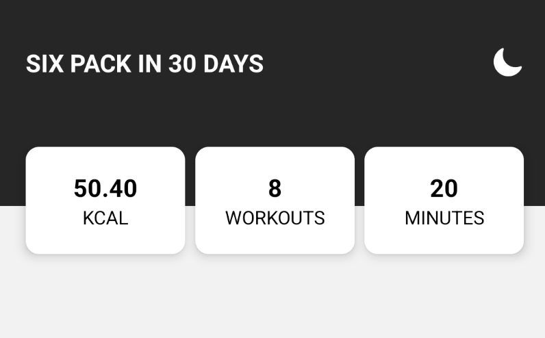
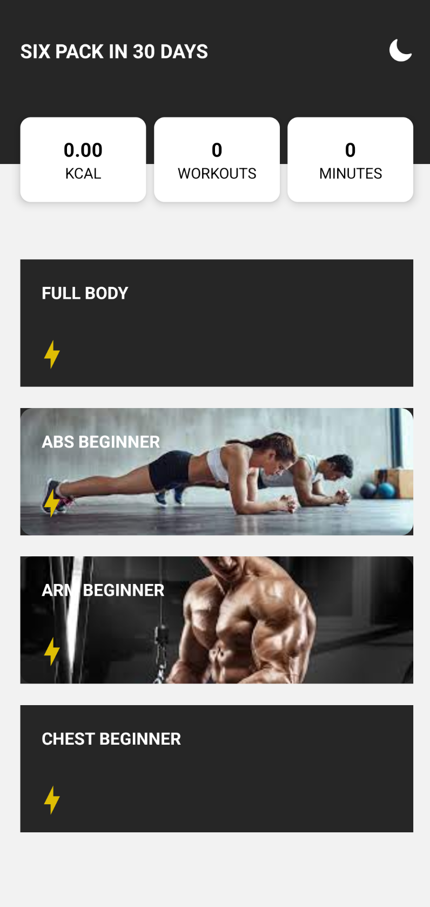
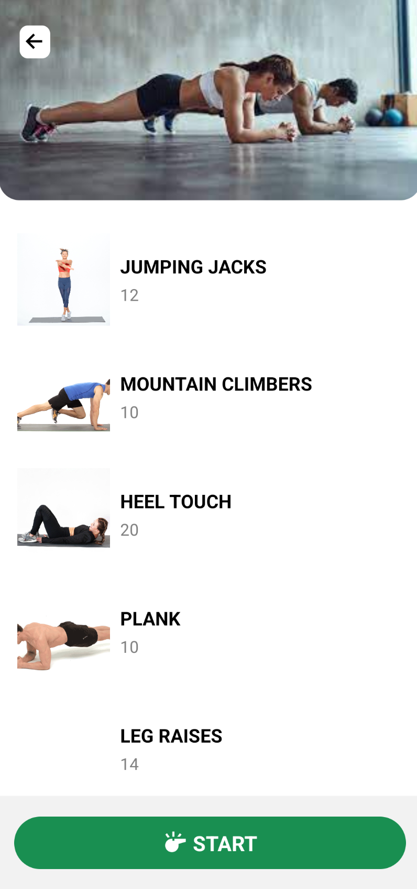
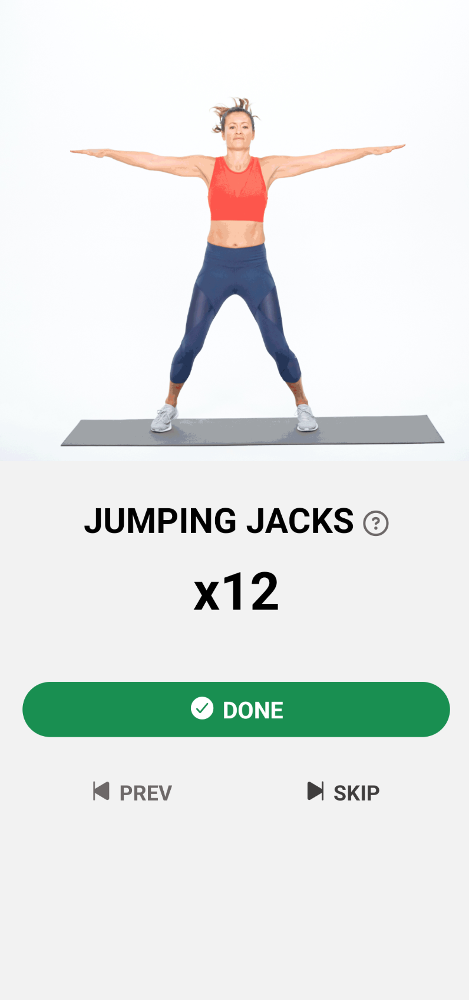

# React Native Fitness App

A **cross-platform fitness tracking app** built with **React Native**, designed to help users stay motivated and track their fitness journey. The app offers workout plans, rest tracking, and a visually engaging dashboard.

---

## Table of Contents

- [Features](#features)
- [Screenshots](#screenshots)
- [Folder Structure](#folder-structure)
- [Installation](#installation)
- [Running the App](#running-the-app)

---

## Features

- **Workout Tracking** – Track exercises, sets, and reps.
- **Predefined Plans** – Offers workout plans tailored for different fitness levels.
- **Rest Management** – Includes rest timers to manage breaks between exercises.
- **Motivational Dashboard** – A central hub to monitor progress and fitness stats.
- **Cross-platform Support** – Runs on both Android and iOS.
- **Reusable Components** – Includes modular UI components for scalability.

---

## Screenshots

### Stats



### Home Scree



### Fitness Screen



### Workout Screen



### Rest Screen


---

## Folder Structure

```
react-native-fitness-app/
├── .expo/ # Expo-specific configuration
├── assets/ # Images, fonts, icons
├── components/ # Reusable UI components
│ └── FitnessCards.js
├── data/ # Data files for app
│ └── fitness.js
├── screens/ # App screens
│ ├── FitScreen.js
│ ├── HomeScreen.js
│ ├── RestScreen.js
│ └── WorkoutScreen.js
├── App.js # Main app entry point
├── app.json # App configuration
├── babel.config.js # Babel configuration
├── Context.js # Context API for state management
├── StackNavigator.js # Navigation setup
├── package.json # Dependencies and scripts
├── package-lock.json
├── yarn.lock
└── readme-images/ # Images for README or documentation
```

---

## Installation

1. **Clone the repository**

```bash
git clone https://github.com/msohaaib/MAD.git
cd MAD/react-native-fitness-app
```

2. **Install Dependencies**

```
npm install

```

## Running the App

```
npm start
```
